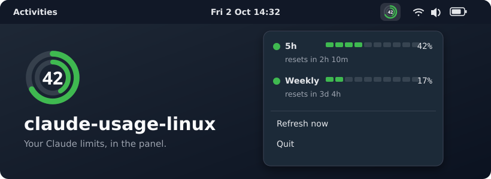

<div align="center">



<h1>claude-usage-linux</h1>

<p><b>See your Claude usage limits in the Linux panel, next to wifi, sound and battery.</b></p>

<p>
<a href="https://github.com/abdulahwahdi/claude-usage-linux/releases/latest"></a>
<a href="https://github.com/abdulahwahdi/claude-usage-linux/actions/workflows/test.yml"></a>

<a href="LICENSE"></a>
</p>

<p>
<a href="#-install">Install</a> ·
<a href="#-configuration">Configuration</a> ·
<a href="#-troubleshooting">Troubleshooting</a>
</p>

</div>

## ✨ Features

- **Two rings, one glance.** The outer ring is the 5-hour window, the inner ring is
  the weekly window. The centre shows the 5-hour percentage.
- **Colour-coded.** Each ring turns amber at 70% and red at 90%.
- **Reset times.** Click the icon for progress bars and when each window resets.
- **One-click login.** If you're logged out, the menu shows **Log in…**, which opens
  `claude auth login` in a terminal.
- **Lightweight.** Python standard library only, no extra packages from pip.

<div align="center">

</div>

Works on any panel with StatusNotifierItem/AppIndicator support: KDE, XFCE,
Cinnamon, MATE, and GNOME with the
[AppIndicator extension](https://extensions.gnome.org/extension/615/appindicator-support/).

## 📦 Install

> [!TIP]
> **Debian, Ubuntu or Mint:** use the one-line installer.
> **Other distros:** use [pip](#from-source-any-distro).

### One-line installer (Debian/Ubuntu/Mint)

```sh
curl -fsSL https://raw.githubusercontent.com/abdulahwahdi/claude-usage-linux/main/install.sh | sh
```

Run it as your normal user, not with `sudo`. It asks for your password when it
needs it. It adds a signed apt repository, so updates arrive with
`sudo apt upgrade`. You can [read the script](install.sh) first.

The installer starts it right away, and it starts on every login after that.
You can also launch **Claude Usage** from your applications menu.

<details>
<summary><b>apt repository, step by step</b></summary>

This does the same thing as the installer:

```sh
sudo install -d -m 0755 /etc/apt/keyrings
sudo curl -fsSL https://abdulahwahdi.github.io/claude-usage-linux/claude-usage-linux.gpg -o /etc/apt/keyrings/claude-usage-linux.gpg
echo 'deb [signed-by=/etc/apt/keyrings/claude-usage-linux.gpg] https://abdulahwahdi.github.io/claude-usage-linux/ ./' | sudo tee /etc/apt/sources.list.d/claude-usage-linux.list
sudo apt update && sudo apt install claude-usage-linux
```

</details>

<details>
<summary><b>Download the .deb (no auto-updates)</b></summary>

```sh
cd "$(mktemp -d)"
curl -fsSLO https://github.com/abdulahwahdi/claude-usage-linux/releases/latest/download/claude-usage-linux_all.deb
curl -fsSLO https://github.com/abdulahwahdi/claude-usage-linux/releases/latest/download/SHA256SUMS
sha256sum -c --ignore-missing SHA256SUMS
sudo apt install ./claude-usage-linux_all.deb
```

Keep the `./`. Without it, apt looks in its repositories instead of the file.
Older versions are on the [Releases page](https://github.com/abdulahwahdi/claude-usage-linux/releases).

</details>

### From source (any distro)

1. Install the dependencies:

   | Distro | Command |
   |---|---|
   | Debian/Ubuntu/Mint | `sudo apt install python3-gi python3-gi-cairo gir1.2-gtk-3.0 gir1.2-ayatanaappindicator3-0.1` |
   | Fedora | `sudo dnf install python3-gobject libayatana-appindicator-gtk3` |
   | Arch | `sudo pacman -S python-gobject python-cairo libayatana-appindicator` |

2. Install, enable autostart and start it:

   ```sh
   git clone https://github.com/abdulahwahdi/claude-usage-linux.git
   cd claude-usage-linux
   pip install --user .
   mkdir -p ~/.config/autostart ~/.local/share/applications ~/.local/share/icons/hicolor/scalable/apps
   cp packaging/claude-usage-linux.desktop ~/.config/autostart/
   cp packaging/claude-usage-linux.desktop ~/.local/share/applications/
   cp packaging/claude-usage-linux.svg ~/.local/share/icons/hicolor/scalable/apps/
   setsid -f claude-usage-linux
   ```

   If pip says `externally-managed-environment`, use
   `pipx install --system-site-packages .` instead.

<details>
<summary><b>Build your own .deb</b></summary>

```sh
sudo apt install build-essential devscripts debhelper dh-python pybuild-plugin-pyproject python3-setuptools
dpkg-buildpackage -us -uc -b
sudo apt install ../claude-usage-linux_*_all.deb
```

</details>

### Uninstall

| Installed with | Remove with |
|---|---|
| installer, apt or .deb | `sudo apt remove claude-usage-linux` |
| pip | `pip uninstall claude-usage-linux && rm ~/.config/autostart/claude-usage-linux.desktop ~/.local/share/applications/claude-usage-linux.desktop ~/.local/share/icons/hicolor/scalable/apps/claude-usage-linux.svg` |

To also remove the apt repository:
`sudo rm /etc/apt/sources.list.d/claude-usage-linux.list /etc/apt/keyrings/claude-usage-linux.gpg`

## 🔧 Configuration

Set these as environment variables or in `~/.config/claude-usage-linux/config.json`.
If both are set, the environment variable wins.

| Setting | Env | Default |
|---|---|---|
| `poll_interval_seconds` | `CLAUDE_USAGE_POLL_INTERVAL` | `120` (minimum 30) |
| `credentials_path` | `CLAUDE_USAGE_CREDENTIALS` | `~/.claude/.credentials.json` |
| `login_command` | `CLAUDE_USAGE_LOGIN_COMMAND` | `claude auth login` |

When rate-limited, it polls less often (up to every 15 minutes) until a request succeeds.

## 🛠 Troubleshooting

| Problem | Fix |
|---|---|
| No icon | On GNOME, install the AppIndicator extension. Elsewhere, add a system tray or status notifier applet to the panel. |
| Startup error about typelibs | Install the [dependencies](#from-source-any-distro). |
| "No terminal found" | Run `claude auth login` yourself, or set `TERMINAL`. |
| Icon disappears when the terminal closes | Start it with `setsid -f claude-usage-linux`, or from the applications menu. |
| "Offline" | It can't reach the API right now and will keep retrying. |
| Boxes instead of coloured dots in the menu | Install an emoji font, e.g. `fonts-noto-color-emoji`. |

## ⚠️ Caveats

Usage comes from an undocumented endpoint (`/api/oauth/usage`), queried with the
token Claude Code stores in `~/.claude/.credentials.json`. The app only reads that
token. The endpoint may change without notice. Missing values show as "n/a".

---

<div align="center">
<sub>MIT licensed · Not affiliated with Anthropic · <a href="docs/RELEASING.md">Releasing</a></sub>
</div>
